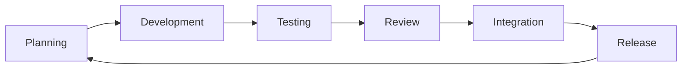

# Development Workflow & Sprint Planning

## Overview

This document outlines the development workflow, sprint structure, and collaboration processes for the Metaphysical Scene Weaver project. Our workflow balances technical rigor with creative exploration.

## Development Workflow

### 1. Git Workflow (Git Flow)

```
main
  └── develop
       ├── feature/MSW-XXX-feature-name
       ├── bugfix/MSW-XXX-bug-description
       ├── hotfix/MSW-XXX-critical-fix
       └── release/v0.X.0
```

**Branch Types:**
- `main`: Production-ready code
- `develop`: Integration branch for features
- `feature/*`: New features and enhancements
- `bugfix/*`: Non-critical bug fixes
- `hotfix/*`: Critical production fixes
- `release/*`: Release preparation

**Branch Naming Convention:**
```
feature/MSW-123-philosophical-depth-analysis
bugfix/MSW-124-parser-unicode-handling
hotfix/MSW-125-api-timeout-fix
```

### 2. Development Cycle



**Daily Flow:**
1. **Morning Sync** (15 min)
   - Review daily goals
   - Identify blockers
   - Pair programming assignments

2. **Development Blocks** (2-3 hours)
   - Feature implementation
   - Test writing
   - Documentation updates

3. **Afternoon Review**
   - Code reviews
   - Integration testing
   - Knowledge sharing

### 3. Task Management

**Task Categories:**
- **P0 (Critical)**: Blocks all work
- **P1 (High)**: Core functionality
- **P2 (Medium)**: Enhancements
- **P3 (Low)**: Nice-to-have

**Task Lifecycle:**
```
Backlog → Sprint Planning → In Progress → Review → Testing → Done
```

**Definition of Done:**
- [ ] Code complete with tests
- [ ] Documentation updated
- [ ] Peer review approved
- [ ] Integration tests pass
- [ ] Performance benchmarks met
- [ ] Philosophical accuracy validated

## Sprint Structure (2-Week Sprints)

### Sprint Timeline

**Week 1: Build Phase**

**Monday - Sprint Planning & Philosophy Alignment**
- 9:00 AM - Sprint Planning (2 hours)
  - Review backlog
  - Estimate tasks
  - Assign ownership
- 11:00 AM - Philosophy Session (1 hour)
  - Discuss philosophical concepts for sprint
  - Align on interpretations
- 2:00 PM - Technical Planning
  - Architecture decisions
  - Integration planning

**Tuesday-Thursday - Core Development**
- Morning: Feature development
- Afternoon: Pairing sessions
- End of day: Progress updates

**Friday - Integration & Testing**
- Morning: Integration work
- Afternoon: End-to-end testing
- 3:00 PM: Weekly demo

**Week 2: Polish Phase**

**Monday-Wednesday - Refinement**
- Feature completion
- Performance optimization
- Edge case handling
- Documentation

**Thursday - Quality Validation**
- Comprehensive testing
- Performance benchmarks
- Philosophy validation
- Visual output review

**Friday - Demo & Retrospective**
- 10:00 AM - Sprint Demo (1 hour)
- 11:00 AM - Retrospective (1 hour)
- 2:00 PM - Sprint Planning Prep

### Sprint Ceremonies

**1. Sprint Planning (2 hours)**
- Review product backlog
- Define sprint goal
- Select and estimate tasks
- Assign task ownership
- Identify dependencies

**2. Daily Standup (15 min)**
- What I did yesterday
- What I'm doing today
- Blockers
- Philosophy insights

**3. Philosophy Alignment (1 hour/week)**
- Review philosophical concepts
- Discuss interpretations
- Validate concept mappings
- Cultural sensitivity check

**4. Sprint Review/Demo (1 hour)**
- Demo completed features
- Review generated prompts
- Stakeholder feedback
- Philosophical accuracy assessment

**5. Sprint Retrospective (1 hour)**
- What went well
- What could improve
- Action items
- Team health check

## Collaboration Model

### 1. Pairing Assignments

**Technical-Creative Pairs:**
- Rex + Sophia: Script parsing with philosophical awareness
- Nova + Iris: API design with prompt optimization
- Luna + Quinn: Emotion mapping with quality validation

**Cross-Domain Pairs:**
- Aria + Each specialist: Architecture reviews
- Sophia + Luna: Philosophy-emotion integration
- Iris + Everyone: Prompt quality reviews

### 2. Communication Channels

**Slack Structure:**
```
#msw-general          - Team announcements
#msw-dev             - Development discussions
#msw-philosophy      - Philosophical interpretations
#msw-visual          - Visual output reviews
#msw-qa              - Testing and quality
#msw-standup         - Daily updates
#msw-random          - Team bonding
```

**Meeting Types:**
- **Technical Reviews**: Code, architecture, performance
- **Creative Reviews**: Prompts, visual outputs, interpretations
- **Philosophy Sessions**: Concept discussions, accuracy checks
- **Integration Meetings**: Cross-component coordination

### 3. Knowledge Sharing

**Weekly Sessions:**
- **Tech Talk Tuesday**: Technical deep dives
- **Philosophy Wednesday**: Concept exploration
- **Demo Friday**: Feature demonstrations

**Documentation Requirements:**
- Design docs for major features
- Philosophy interpretation guides
- Visual mapping documentation
- API usage examples

## Quality Assurance Process

### 1. Testing Strategy

**Test Pyramid:**
```
        E2E Tests (10%)
     Integration Tests (30%)
   Unit Tests (60%)
```

**Test Coverage Requirements:**
- Unit Tests: 80% minimum
- Integration Tests: Critical paths
- E2E Tests: User workflows
- Philosophy Tests: Concept accuracy

### 2. Review Process

**Code Review Checklist:**
- [ ] Functionality correct
- [ ] Tests comprehensive
- [ ] Documentation updated
- [ ] Performance acceptable
- [ ] Philosophy accurate
- [ ] Visual output quality

**Philosophy Review:**
- Concept identification accuracy
- Visual symbol appropriateness
- Depth level assessment
- Cultural sensitivity

### 3. Performance Benchmarks

**Processing Targets:**
- Script parsing: <100ms/entry
- Philosophy analysis: <500ms/scene
- Emotion mapping: <200ms/scene
- Prompt generation: <200ms/scene
- Total pipeline: <5s/scene

## Release Process

### 1. Release Types

**Major Release (v1.0.0)**
- New philosophical frameworks
- Architecture changes
- Breaking API changes

**Minor Release (v0.1.0)**
- New features
- Processor enhancements
- Non-breaking improvements

**Patch Release (v0.0.1)**
- Bug fixes
- Performance improvements
- Documentation updates

### 2. Release Checklist

- [ ] All tests passing
- [ ] Documentation updated
- [ ] Performance benchmarks met
- [ ] Philosophy validation complete
- [ ] Visual output quality verified
- [ ] API compatibility checked
- [ ] Release notes prepared
- [ ] Stakeholder approval

### 3. Deployment Pipeline

```
develop → release/vX.X.X → main → production
```

**Steps:**
1. Create release branch
2. Version bump
3. Final testing
4. Release notes
5. Merge to main
6. Tag release
7. Deploy to production
8. Post-deployment verification

## Team Dynamics

### 1. Core Values

- **Philosophical Integrity**: Accurate representation of concepts
- **Creative Excellence**: High-quality visual outputs
- **Technical Craftsmanship**: Clean, maintainable code
- **Collaborative Spirit**: Cross-functional cooperation
- **Continuous Learning**: Growth in philosophy and tech

### 2. Conflict Resolution

**Technical Disagreements:**
1. Discussion in team channel
2. Proof of concept if needed
3. Team vote or Aria's decision
4. Document decision rationale

**Philosophy Interpretations:**
1. Research source material
2. Sophia leads discussion
3. Consensus building
4. Document interpretation

### 3. Team Health

**Weekly Check-ins:**
- Workload balance
- Stress levels
- Learning opportunities
- Team morale

**Monthly Reviews:**
- Individual growth plans
- Team effectiveness
- Process improvements
- Tool evaluations

## Tools & Infrastructure

### Development Tools

**IDE/Editors:**
- VS Code with Python extensions
- PyCharm for complex debugging
- Vim/Emacs for quick edits

**Python Tools:**
- Poetry for dependency management
- Black for formatting
- Ruff for linting
- mypy for type checking
- pytest for testing

**Collaboration:**
- GitHub for version control
- GitHub Projects for planning
- Slack for communication
- Notion for documentation

### Infrastructure

**Development Environment:**
- Python 3.9+ virtual environments
- Docker for consistency
- Pre-commit hooks
- CI/CD with GitHub Actions

**Monitoring:**
- Performance dashboards
- Error tracking
- API metrics
- Generation quality metrics

## Continuous Improvement

### 1. Metrics Tracking

**Development Metrics:**
- Sprint velocity
- Bug escape rate
- Code review turnaround
- Test coverage trends

**Quality Metrics:**
- Philosophy accuracy rate
- Visual prompt quality scores
- Processing performance
- API reliability

### 2. Process Evolution

**Sprint Retrospective Actions:**
- Process improvements
- Tool adoptions
- Workflow optimizations
- Team structure adjustments

**Quarterly Reviews:**
- Architecture evolution
- Team skill development
- Process effectiveness
- Strategic alignment

## Onboarding Process

### Week 1: Foundation
- Read philosophical source material
- Environment setup
- Architecture overview
- Meet team members
- First code review observation

### Week 2: Hands-On
- Pair programming sessions
- Small bug fixes
- Write first tests
- Attend philosophy session
- First code contribution

### Week 3: Integration
- Feature development
- Cross-team collaboration
- Lead a code review
- Present in team meeting
- Independent task ownership

### Success Criteria
- Understands architecture
- Can explain philosophy mapping
- Contributes quality code
- Collaborates effectively
- Shows domain growth

This workflow ensures we maintain high technical standards while honoring the creative and philosophical depth required for the Metaphysical Scene Weaver project.