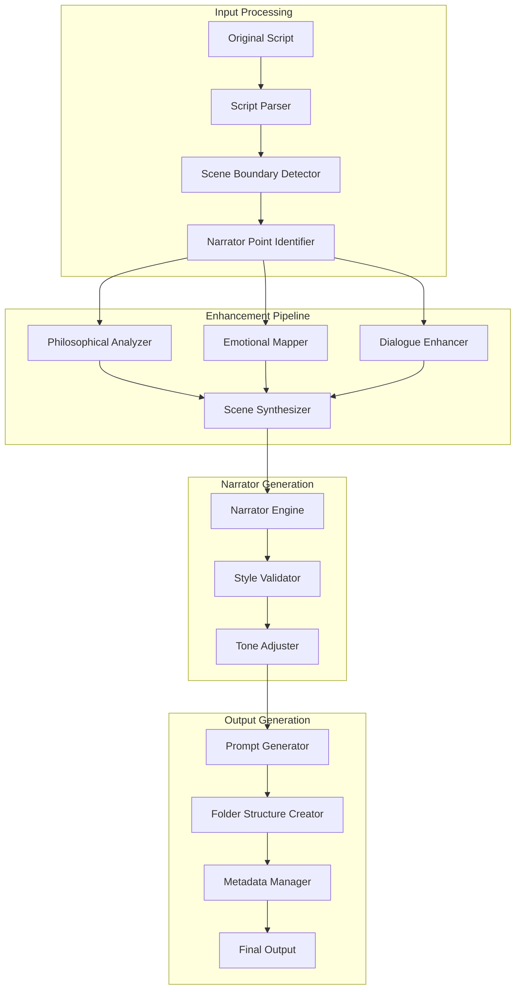

# Program 1: Script-to-Folder Generator Architecture

## Overview

Program 1 transforms philosophical dialogue scripts into an organized folder structure with enriched prompts, incorporating professional narrator elements for graphic novel generation.

## System Architecture



## Core Components

### 1. Enhanced Script Parser
**Owner**: Rex
**Location**: `src/processors/enhanced_script_parser.py`

```python
class EnhancedScriptParser:
    """Parse scripts and identify narrator insertion points."""
    
    def parse_with_narrator_points(self, script_path: Path) -> List[EnhancedEntry]:
        """
        Parse script and identify where narrator commentary should be added.
        
        Returns:
            List of enhanced entries with narrator_needed flags
        """
        pass
    
    def detect_scene_boundaries(self, entries: List[ScriptEntry]) -> List[SceneBoundary]:
        """Identify natural scene breaks for narrator insertion."""
        pass
    
    def classify_entry_type(self, entry: ScriptEntry) -> EntryType:
        """Classify as dialogue, action, transition, etc."""
        pass
```

### 2. Narrator Engine
**Owner**: Rex (lead), Sophia (philosophy), Luna (emotion)
**Location**: `src/core/narrator_engine.py`

```python
class NarratorEngine:
    """Generate contextual narrator commentary."""
    
    def generate_narrator_text(
        self,
        context: NarratorContext,
        style_params: StyleParameters
    ) -> NarratorText:
        """
        Generate appropriate narrator commentary for context.
        
        Args:
            context: Scene context, philosophical themes, emotions
            style_params: Tone, length, depth level
            
        Returns:
            Narrator text with metadata
        """
        pass
    
    def validate_consistency(self, text: str, previous_texts: List[str]) -> bool:
        """Ensure narrator voice remains consistent."""
        pass
```

### 3. Scene Synthesizer Plus
**Owner**: Nova
**Location**: `src/processors/scene_synthesizer_plus.py`

```python
class SceneSynthesizerPlus:
    """Enhanced scene synthesis with narrator integration."""
    
    def synthesize_with_narrator(
        self,
        dialogue_entry: EnhancedEntry,
        narrator_text: Optional[NarratorText],
        visual_elements: VisualElements
    ) -> CompletedScene:
        """
        Combine all elements into cohesive scene.
        
        Returns:
            Complete scene with narrator, dialogue, and visuals
        """
        pass
    
    def generate_transition_strip(
        self,
        scene_a: CompletedScene,
        scene_b: CompletedScene
    ) -> TransitionStrip:
        """Create visual transition between scenes."""
        pass
```

### 4. Folder Structure Generator
**Owner**: Nova
**Location**: `src/core/folder_generator.py`

```python
class FolderGenerator:
    """Generate organized folder structure for graphic novel."""
    
    def generate_structure(
        self,
        scenes: List[CompletedScene],
        output_path: Path
    ) -> FolderStructure:
        """
        Create folder structure with all content.
        
        Structure:
            content/
            ├── 001/
            │   ├── 001.txt (enriched prompt)
            │   ├── metadata.json
            │   ├── narrator.txt
            │   └── philosophy.json
            ├── 002/
            │   └── ...
            ├── transitions/
            │   ├── 001-002.txt
            │   └── ...
            └── index.json
        """
        pass
```

### 5. Prompt Enhancement System
**Owner**: Iris
**Location**: `src/processors/prompt_enhancer.py`

```python
class PromptEnhancer:
    """Optimize prompts for image generation."""
    
    def enhance_for_visual_generation(
        self,
        scene: CompletedScene,
        style_guide: VisualStyleGuide
    ) -> EnhancedPrompt:
        """
        Transform scene into optimized visual prompt.
        
        Includes:
        - Visual composition details
        - Atmospheric elements
        - Character positioning
        - Philosophical visual metaphors
        - Emotional color palettes
        """
        pass
```

## Data Flow

### Input Format
```python
@dataclass
class EnhancedEntry:
    id: str
    speaker: str
    dialogue: str
    entry_type: EntryType
    narrator_needed: bool
    scene_boundary: bool
    philosophical_concepts: List[str]
    emotional_state: EmotionalState
    visual_cues: List[str]
    metadata: Dict[str, Any]
```

### Output Format
```python
@dataclass
class FolderContent:
    scene_id: str
    prompt_text: str
    narrator_text: Optional[str]
    metadata: Dict[str, Any]
    philosophy_notes: Dict[str, Any]
    visual_elements: List[str]
    transition_to_next: Optional[str]
```

## Narrator Integration Points

### 1. Scene Openings
```python
def insert_scene_opening_narrator(scene: Scene) -> NarratorText:
    """
    Generate opening narrator for new scene.
    
    Considers:
    - Location change
    - Time shift
    - Mood transition
    - Philosophical theme introduction
    """
    pass
```

### 2. Philosophical Bridges
```python
def create_philosophical_bridge(
    concept_a: PhilosophicalConcept,
    concept_b: PhilosophicalConcept
) -> NarratorText:
    """Bridge between philosophical ideas."""
    pass
```

### 3. Emotional Transitions
```python
def narrate_emotional_shift(
    emotion_before: EmotionalState,
    emotion_after: EmotionalState
) -> NarratorText:
    """Narrate emotional transitions."""
    pass
```

## Sample Output Structure

```
content/
├── 001/
│   ├── 001.txt
│   │   """
│   │   A liminal space between dream and waking. Evan's face in extreme 
│   │   close-up, eyes reflecting infinite recursive mirrors. Fragments of 
│   │   reality float like autumn leaves in a void. Color palette: deep 
│   │   purples and golds with reality fractures showing through.
│   │   
│   │   Character: Evan, contemplative, seeking
│   │   Mood: Philosophical wonder tinged with existential weight
│   │   Visual metaphor: Consciousness as shattered mirror reforming
│   │   """
│   ├── narrator.txt
│   │   """
│   │   In the space between one thought and the next, where certainty 
│   │   dissolves like sugar in rain, two seekers prepare to taste the 
│   │   flavor of existence itself.
│   │   """
│   ├── metadata.json
│   │   {
│   │     "scene_id": "001",
│   │     "panel_count": 2,
│   │     "philosophy_depth": 3,
│   │     "primary_concepts": ["consciousness", "existence"],
│   │     "emotional_tone": "seeking",
│   │     "visual_complexity": "high"
│   │   }
│   └── philosophy.json
│       {
│         "concepts": ["consciousness", "existence", "perception"],
│         "visual_symbols": ["mirrors", "fractals", "void"],
│         "depth_level": 3,
│         "school": "phenomenology"
│       }
├── transitions/
│   └── 001-002.txt
│       """
│       The question hangs in space, creating ripples in reality. 
│       Transition through fracturing mirror shards that reform into 
│       Monday's contemplative expression.
│       """
└── index.json
    {
      "total_scenes": 150,
      "chapters": [...],
      "narrator_style": "contemplative",
      "philosophical_themes": [...],
      "generation_date": "2024-01-15"
    }
```

## Quality Validation

### Narrator Consistency Checker
```python
class NarratorValidator:
    def validate_voice_consistency(self, all_narrator_texts: List[str]) -> Report:
        """Check narrator maintains consistent voice."""
        pass
    
    def validate_philosophical_accuracy(self, narrator_text: str, concepts: List[str]) -> bool:
        """Ensure narrator correctly represents philosophical themes."""
        pass
    
    def check_integration_quality(self, scene: CompletedScene) -> QualityScore:
        """Validate narrator enhances rather than disrupts."""
        pass
```

## Technical Requirements

### Performance Targets
- Process 150-scene script in < 60 seconds
- Generate narrator text in < 500ms per scene
- Validate consistency in < 100ms per check
- Complete folder generation in < 10 seconds

### Error Handling
- Graceful handling of missing narrator points
- Fallback templates for edge cases
- Validation warnings vs errors
- Recovery from partial processing

## Implementation Timeline

### Week 1 Tasks
1. **Rex**: Build enhanced parser with narrator detection
2. **Sophia**: Create philosophical narrator rules
3. **Luna**: Design emotion-to-narrator mapping
4. **Nova**: Prototype folder structure
5. **Iris**: Develop prompt templates

### Week 2 Tasks
1. **Integration**: Connect all components
2. **Testing**: Unit tests for each module
3. **Validation**: Narrator consistency checks
4. **Optimization**: Performance tuning

## Success Metrics

1. **Narrator Quality**
   - Natural insertion points (> 90% appropriate)
   - Voice consistency (> 95% uniform tone)
   - Philosophical accuracy (100% conceptually sound)

2. **Technical Performance**
   - Processing speed meets targets
   - Memory usage < 500MB
   - Error rate < 1%

3. **Output Quality**
   - Folder structure intuitive and complete
   - Prompts generate quality images
   - Metadata comprehensive and accurate

This architecture ensures Program 1 delivers professionally enhanced scripts ready for graphic novel visualization.