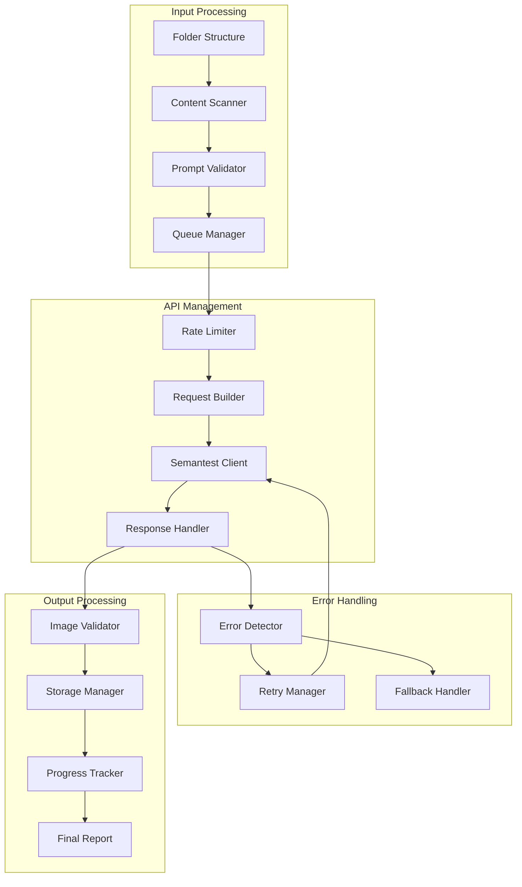

# Program 2: Folder-to-Semantest Integration Architecture

## Overview

Program 2 reads the enriched folder structure created by Program 1 and interfaces with Semantest to generate high-quality images for each scene in the graphic novel.

## System Architecture



## Core Components

### 1. Content Scanner
**Owner**: Nova
**Location**: `src/integrations/content_scanner.py`

```python
class ContentScanner:
    """Scan folder structure and prepare for processing."""
    
    def scan_folder_structure(self, base_path: Path) -> ContentManifest:
        """
        Scan and validate folder structure.
        
        Returns:
            Manifest of all content to process
        """
        pass
    
    def load_scene_content(self, scene_path: Path) -> SceneContent:
        """Load all content for a single scene."""
        return SceneContent(
            prompt=self._load_prompt(scene_path),
            metadata=self._load_metadata(scene_path),
            narrator=self._load_narrator(scene_path)
        )
    
    def validate_structure(self, manifest: ContentManifest) -> ValidationReport:
        """Ensure folder structure is complete and valid."""
        pass
```

### 2. Semantest Client Enhanced
**Owner**: Nova (lead), Iris (optimization)
**Location**: `src/integrations/semantest_client_enhanced.py`

```python
class SemantestClientEnhanced:
    """Enhanced Semantest client with robust error handling."""
    
    def __init__(self, api_key: str, config: ClientConfig):
        self.api_key = api_key
        self.config = config
        self.rate_limiter = RateLimiter(config.rate_limit)
        self.retry_policy = RetryPolicy(config.retry_settings)
    
    async def generate_image(
        self,
        prompt: str,
        scene_id: str,
        style_params: Optional[StyleParameters] = None
    ) -> GenerationResult:
        """
        Generate image via Semantest API.
        
        Args:
            prompt: Enhanced visual prompt
            scene_id: Unique scene identifier
            style_params: Additional style parameters
            
        Returns:
            Generation result with image URL or error
        """
        pass
    
    async def batch_generate(
        self,
        scenes: List[SceneContent],
        progress_callback: Callable
    ) -> BatchResults:
        """Process multiple scenes with progress tracking."""
        pass
```

### 3. Queue Management System
**Owner**: Nova
**Location**: `src/integrations/queue_manager.py`

```python
class QueueManager:
    """Manage generation queue with priorities and retries."""
    
    def __init__(self, max_concurrent: int = 5):
        self.queue = asyncio.PriorityQueue()
        self.active_tasks = {}
        self.max_concurrent = max_concurrent
    
    async def add_to_queue(
        self,
        scene: SceneContent,
        priority: int = 5
    ) -> str:
        """Add scene to processing queue."""
        pass
    
    async def process_queue(self) -> None:
        """Process queue with concurrent limit."""
        pass
    
    def get_queue_status(self) -> QueueStatus:
        """Get current queue status and progress."""
        return QueueStatus(
            pending=self.queue.qsize(),
            active=len(self.active_tasks),
            completed=self.completed_count,
            failed=self.failed_count
        )
```

### 4. Error Recovery System
**Owner**: Quinn
**Location**: `src/integrations/error_recovery.py`

```python
class ErrorRecoverySystem:
    """Handle API errors with intelligent recovery."""
    
    def __init__(self):
        self.error_patterns = self._load_error_patterns()
        self.recovery_strategies = self._init_strategies()
    
    def analyze_error(self, error: Exception) -> ErrorAnalysis:
        """Analyze error and determine recovery strategy."""
        pass
    
    def apply_recovery(
        self,
        error_analysis: ErrorAnalysis,
        original_request: GenerationRequest
    ) -> RecoveryAction:
        """Apply appropriate recovery strategy."""
        if error_analysis.error_type == ErrorType.RATE_LIMIT:
            return RecoveryAction.BACKOFF
        elif error_analysis.error_type == ErrorType.PROMPT_INVALID:
            return RecoveryAction.MODIFY_PROMPT
        elif error_analysis.error_type == ErrorType.API_DOWN:
            return RecoveryAction.QUEUE_FOR_LATER
        else:
            return RecoveryAction.FAIL_GRACEFULLY
```

### 5. Image Validation System
**Owner**: Quinn (lead), Iris (quality)
**Location**: `src/integrations/image_validator.py`

```python
class ImageValidator:
    """Validate generated images meet quality standards."""
    
    def validate_image(
        self,
        image_url: str,
        scene_content: SceneContent
    ) -> ValidationResult:
        """
        Validate generated image.
        
        Checks:
        - Image accessibility
        - Basic quality metrics
        - Content appropriateness
        - Style consistency
        """
        pass
    
    def check_consistency(
        self,
        current_image: str,
        previous_images: List[str]
    ) -> ConsistencyScore:
        """Check visual consistency across scenes."""
        pass
```

## API Integration Details

### Request Format
```python
@dataclass
class SemantestRequest:
    prompt: str
    style: str = "graphic novel"
    aspect_ratio: str = "16:9"
    quality: str = "high"
    negative_prompt: Optional[str] = None
    seed: Optional[int] = None
    guidance_scale: float = 7.5
    
    def to_api_payload(self) -> Dict[str, Any]:
        """Convert to Semantest API format."""
        return {
            "prompt": self.prompt,
            "style_preset": self.style,
            "aspect_ratio": self.aspect_ratio,
            "quality": self.quality,
            "negative_prompt": self.negative_prompt,
            "cfg_scale": self.guidance_scale,
            "seed": self.seed
        }
```

### Response Handling
```python
@dataclass
class SemantestResponse:
    success: bool
    image_url: Optional[str]
    error_message: Optional[str]
    generation_id: str
    metadata: Dict[str, Any]
    
    @classmethod
    def from_api_response(cls, response: Dict) -> 'SemantestResponse':
        """Parse API response."""
        pass
```

## Rate Limiting Strategy

### Intelligent Rate Limiter
```python
class IntelligentRateLimiter:
    """Advanced rate limiting with burst support."""
    
    def __init__(self, base_rate: int, burst_allowance: int):
        self.base_rate = base_rate  # requests per minute
        self.burst_allowance = burst_allowance
        self.request_history = deque()
        
    async def acquire(self) -> None:
        """Wait if necessary to respect rate limits."""
        current_time = time.time()
        self._clean_old_requests(current_time)
        
        if len(self.request_history) >= self.base_rate:
            wait_time = 60 - (current_time - self.request_history[0])
            if wait_time > 0:
                await asyncio.sleep(wait_time)
        
        self.request_history.append(current_time)
```

## Progress Tracking

### Real-time Progress Monitor
```python
class ProgressMonitor:
    """Track and report generation progress."""
    
    def __init__(self, total_scenes: int):
        self.total_scenes = total_scenes
        self.completed = 0
        self.failed = 0
        self.start_time = time.time()
        
    def update_progress(self, scene_id: str, status: GenerationStatus):
        """Update progress for a scene."""
        if status == GenerationStatus.COMPLETED:
            self.completed += 1
        elif status == GenerationStatus.FAILED:
            self.failed += 1
            
    def get_progress_report(self) -> ProgressReport:
        """Get detailed progress report."""
        elapsed = time.time() - self.start_time
        rate = self.completed / elapsed if elapsed > 0 else 0
        eta = (self.total_scenes - self.completed) / rate if rate > 0 else 0
        
        return ProgressReport(
            total=self.total_scenes,
            completed=self.completed,
            failed=self.failed,
            success_rate=self.completed / (self.completed + self.failed),
            average_time_per_scene=elapsed / self.completed if self.completed > 0 else 0,
            estimated_time_remaining=eta
        )
```

## Output Structure

### Generated Images Organization
```
output/
├── images/
│   ├── 001.png
│   ├── 002.png
│   └── ...
├── metadata/
│   ├── 001_meta.json
│   ├── 002_meta.json
│   └── ...
├── failures/
│   ├── failed_scenes.json
│   └── error_log.txt
├── report/
│   ├── generation_report.html
│   ├── statistics.json
│   └── quality_metrics.csv
└── backup/
    └── prompts_backup.json
```

## Error Handling Strategies

### 1. Rate Limit Errors
- Exponential backoff with jitter
- Queue redistribution
- Off-peak scheduling

### 2. API Errors
- Automatic retry with modified parameters
- Prompt simplification
- Style parameter adjustment

### 3. Network Errors
- Connection pooling
- Timeout management
- Circuit breaker pattern

### 4. Content Errors
- Prompt validation and sanitization
- Automatic prompt enhancement
- Fallback templates

## Quality Assurance

### Automated Checks
```python
class QualityAssurance:
    """Automated quality checks for generated images."""
    
    def run_quality_checks(self, generation_results: List[GenerationResult]) -> QAReport:
        """Run comprehensive quality checks."""
        return QAReport(
            consistency_score=self._check_visual_consistency(generation_results),
            completeness=self._check_completeness(generation_results),
            error_rate=self._calculate_error_rate(generation_results),
            style_adherence=self._check_style_adherence(generation_results),
            recommendations=self._generate_recommendations(generation_results)
        )
```

## Performance Optimization

### Concurrent Processing
- Optimal concurrency: 5-10 requests
- Dynamic adjustment based on API response times
- Memory-efficient streaming

### Caching Strategy
- Cache successful prompts and settings
- Reuse style parameters across similar scenes
- Store API responses for debugging

## Configuration

### Program 2 Configuration
```yaml
semantest:
  api_key: ${SEMANTEST_API_KEY}
  endpoint: "https://api.semantest.com/v1"
  timeout: 30
  max_retries: 3
  
rate_limiting:
  requests_per_minute: 60
  burst_size: 10
  backoff_multiplier: 1.5
  
processing:
  max_concurrent: 5
  batch_size: 10
  priority_scenes: ["001", "010", "050", "100", "150"]
  
quality:
  min_success_rate: 0.95
  consistency_threshold: 0.8
  validation_enabled: true
  
output:
  image_format: "png"
  image_quality: 95
  metadata_format: "json"
  report_format: "html"
```

## Implementation Timeline

### Week 3 Focus
1. **Nova**: Core Semantest client and queue system
2. **Quinn**: Error handling and recovery
3. **Iris**: Prompt optimization for API

### Week 4 Focus
1. **Integration**: Connect with Program 1 output
2. **Testing**: API integration tests
3. **Optimization**: Performance tuning
4. **Documentation**: User guide and troubleshooting

## Success Metrics

1. **Reliability**
   - API success rate > 95%
   - Automatic recovery rate > 90%
   - Zero data loss

2. **Performance**
   - Average generation time < 30s per image
   - Throughput > 100 images/hour
   - Memory usage < 1GB

3. **Quality**
   - Visual consistency > 85%
   - Style adherence > 90%
   - User satisfaction > 90%

This architecture ensures Program 2 reliably generates high-quality images while handling the complexities of external API integration.