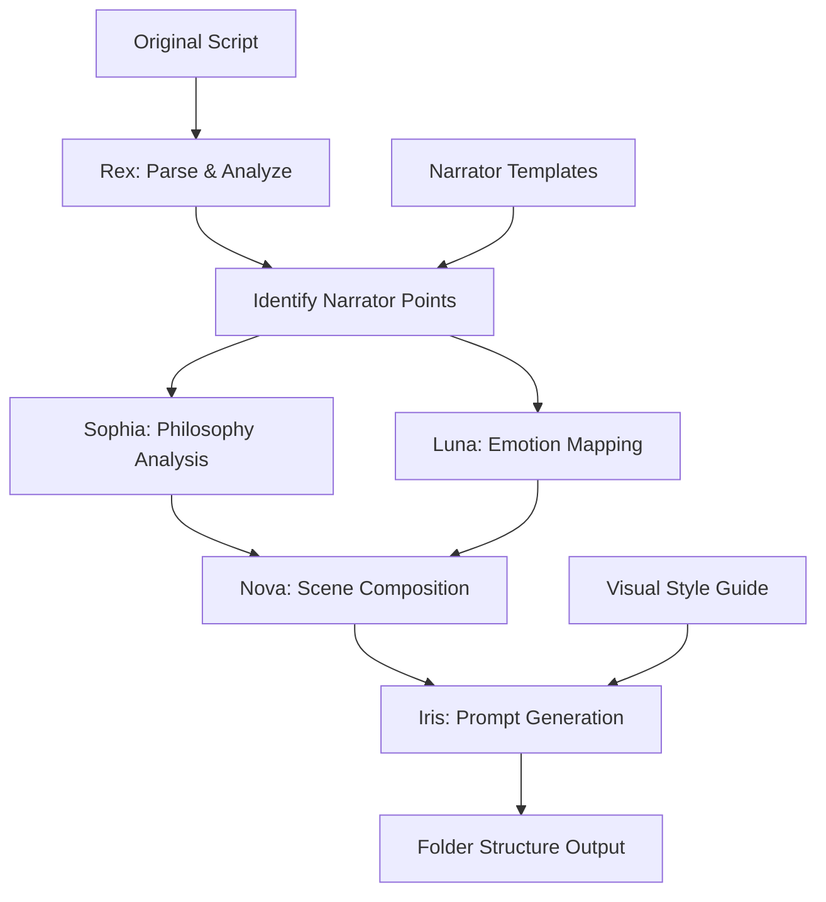
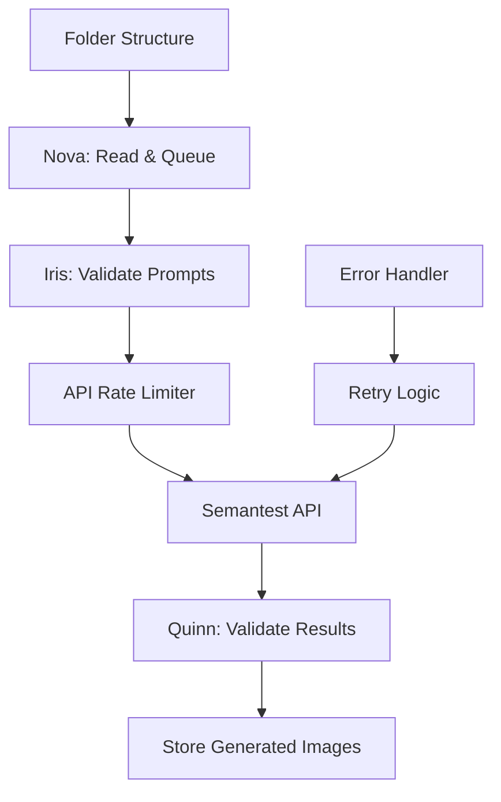

# Metaphysical Scene Weaver - Comprehensive Project Plan

## Executive Summary

This project plan outlines the development of two core programs to transform philosophical dialogue scripts into enriched graphic novel content. The system will add professional narrator elements and generate folder structures ready for image generation via Semantest.

## Project Objectives

### Primary Goal
Transform philosophical dialogue scripts into professionally structured graphic novel content with:
- Enriched visual prompts
- Professional narrator commentary
- Scene-setting descriptions
- Visual transition strips
- Organized folder structure for image generation

### Deliverables
1. **Program 1**: Script-to-Folder Generator with narrator enhancement
2. **Program 2**: Folder-to-Semantest Integration for image generation
3. **Documentation**: User guides and API documentation
4. **Quality Standards**: Testing suite and validation tools

## Project Timeline

### Phase 1: Foundation & Analysis (Week 1)
**Sprint 1: Days 1-5**
- Script analysis and narrator insertion points identification
- Architecture design for both programs
- Narrator style guide development
- Folder structure optimization

### Phase 2: Core Development (Weeks 2-3)
**Sprint 2: Days 6-10**
- Program 1 core implementation
- Narrator enhancement system
- Prompt enrichment pipeline

**Sprint 3: Days 11-15**
- Program 2 development
- Semantest API integration
- Error handling and retry logic

### Phase 3: Integration & Polish (Week 4)
**Sprint 4: Days 16-20**
- End-to-end testing
- Performance optimization
- Documentation completion
- Final quality assurance

## Team Assignments & Responsibilities

### Rex - Script Enhancement Lead
**Primary Responsibilities:**
- Lead narrator insertion system development
- Design dialogue-to-narrator transition logic
- Implement scene boundary detection
- Create narrator voice consistency engine

**Specific Tasks:**
1. Analyze existing script for narrator insertion points
2. Develop narrator commentary templates
3. Implement scene transition detection algorithm
4. Create dialogue enhancement rules
5. Build script preprocessing pipeline

**Deliverables:**
- Narrator insertion module
- Scene transition detector
- Enhanced script parser
- Narrator style guide

### Sophia - Philosophical Interpretation Specialist
**Primary Responsibilities:**
- Philosophical depth analysis for narrator commentary
- Concept-to-visual metaphor mapping
- Philosophical continuity across scenes
- Eastern-Western philosophy integration

**Specific Tasks:**
1. Create philosophical concept extraction system
2. Design narrator philosophical commentary rules
3. Map abstract concepts to visual symbols
4. Ensure philosophical coherence in transitions
5. Develop depth-level classification for scenes

**Deliverables:**
- Philosophical analysis engine
- Concept-to-narrator mapping system
- Visual metaphor library
- Philosophy consistency validator

### Luna - Emotional Mapping Architect
**Primary Responsibilities:**
- Emotion-to-visual translation system
- Character emotional arc tracking
- Mood-based narrator tone adjustment
- Visual atmosphere generation

**Specific Tasks:**
1. Build emotion detection and classification system
2. Create emotional continuity tracker
3. Design mood-to-visual mapping rules
4. Implement narrator emotional tone engine
5. Develop character state evolution system

**Deliverables:**
- Emotion analysis module
- Visual mood generator
- Character state tracker
- Emotional narrator adapter

### Nova - Scene Composition Engineer
**Primary Responsibilities:**
- Scene synthesis and composition
- Folder structure generation
- Program architecture implementation
- Data flow optimization

**Specific Tasks:**
1. Design optimal folder structure system
2. Implement scene composition algorithm
3. Create prompt file generation system
4. Build metadata management system
5. Develop scene indexing and navigation

**Deliverables:**
- Folder structure generator
- Scene composition engine
- Metadata system
- Navigation index generator

### Iris - Visual Prompting Specialist
**Primary Responsibilities:**
- Visual prompt optimization
- Style consistency enforcement
- Prompt template development
- Semantest integration design

**Specific Tasks:**
1. Create comprehensive prompt templates
2. Design visual style consistency system
3. Optimize prompts for Semantest
4. Build prompt variation engine
5. Implement quality validation checks

**Deliverables:**
- Prompt template library
- Style consistency engine
- Semantest optimization module
- Prompt quality validator

### Quinn - Integration & Quality Lead
**Primary Responsibilities:**
- End-to-end integration testing
- Quality assurance framework
- Performance benchmarking
- API integration validation

**Specific Tasks:**
1. Develop comprehensive test suite
2. Create integration test scenarios
3. Build performance benchmarking system
4. Implement quality metrics tracking
5. Design user acceptance tests

**Deliverables:**
- Test suite framework
- Integration test scenarios
- Performance benchmarks
- Quality metrics dashboard

## Detailed Workflow

### Program 1: Script-to-Folder Generator



**Folder Structure Output:**
```
content/
├── 001/
│   ├── 001.txt (enriched prompt)
│   ├── metadata.json
│   └── narrator_notes.txt
├── 002/
│   ├── 002.txt
│   ├── metadata.json
│   └── narrator_notes.txt
├── transitions/
│   ├── 001-002.txt
│   └── metadata.json
└── index.json
```

### Program 2: Folder-to-Semantest Integration



## Narrator Enhancement Strategy

### Narrator Insertion Points
1. **Scene Openings**: Establish setting and atmosphere
2. **Character Introductions**: Provide context and background
3. **Philosophical Moments**: Clarify abstract concepts
4. **Emotional Peaks**: Enhance dramatic tension
5. **Scene Transitions**: Bridge between locations/times
6. **Chapter Endings**: Reflection and foreshadowing

### Narrator Voice Guidelines
- **Tone**: Contemplative, insightful, never intrusive
- **Perspective**: Omniscient but respectful of mystery
- **Style**: Literary quality matching philosophical depth
- **Length**: 2-4 sentences for transitions, 1 paragraph for major scenes

### Example Narrator Enhancement

**Original Script:**
```
[0001] Evan: <<Have you ever noticed how existence tastes?>>
```

**Enhanced with Narrator:**
```
NARRATOR: In the liminal space between dream and waking, where consciousness 
first stirs against the weight of being, two figures meet at the threshold 
of understanding.

[0001] [2-panel] Evan: <<Have you ever noticed how existence tastes?>>

Visual: Close-up of Evan's contemplative face dissolving into abstract 
patterns suggesting synaesthesia, taste becoming color becoming thought.
```

## Quality Control Checkpoints

### Sprint Reviews
**Week 1 Review:**
- Narrator style guide approval
- Architecture sign-off
- Script analysis completion

**Week 2 Review:**
- Program 1 alpha version
- Narrator enhancement samples
- Integration test plan

**Week 3 Review:**
- Program 2 beta version
- Semantest integration demo
- Performance metrics

**Week 4 Review:**
- Full system demonstration
- Quality metrics review
- Documentation approval

### Daily Standups
- 15-minute sync at 9:00 AM
- Blockers identification
- Progress updates
- Cross-team coordination

### Quality Metrics
1. **Narrator Quality**: Coherence, tone consistency, philosophical accuracy
2. **Prompt Effectiveness**: Visual richness, clarity, Semantest compatibility
3. **Technical Performance**: Processing speed, error rate, resource usage
4. **Integration Success**: API reliability, image generation quality

## Risk Management

### Technical Risks
1. **Semantest API Limitations**
   - Mitigation: Implement robust retry logic and queuing
   - Owner: Nova

2. **Narrator Tone Consistency**
   - Mitigation: Develop comprehensive style guide and validation
   - Owner: Rex

3. **Philosophical Coherence**
   - Mitigation: Multi-stage review process
   - Owner: Sophia

### Schedule Risks
1. **Integration Delays**
   - Mitigation: Early API testing and mocking
   - Owner: Quinn

2. **Quality Issues**
   - Mitigation: Continuous testing throughout development
   - Owner: All team members

## Communication Plan

### Channels
- **Daily**: Slack #msw-dev for updates
- **Weekly**: Video call for sprint planning/review
- **Ad-hoc**: Direct messages for urgent issues

### Documentation
- **Code**: Inline comments and docstrings
- **API**: OpenAPI specifications
- **User**: Step-by-step guides with examples

### Reporting
- **Daily**: Progress updates in standup
- **Weekly**: Sprint report with metrics
- **Milestone**: Comprehensive review document

## Success Criteria

### Program 1 Success Metrics
- ✓ Processes script in <30 seconds
- ✓ Narrator insertions feel natural and enhance story
- ✓ Folder structure is clean and navigable
- ✓ Prompts generate high-quality images
- ✓ Philosophical depth is preserved and enhanced

### Program 2 Success Metrics
- ✓ Reliable Semantest integration (>95% success rate)
- ✓ Efficient batch processing
- ✓ Proper error handling and recovery
- ✓ Image quality validation
- ✓ Complete documentation

## Next Steps

### Immediate Actions (Day 1)
1. **All Team**: Review this plan and provide feedback
2. **Rex**: Begin script analysis for narrator points
3. **Sophia**: Start philosophical concept mapping
4. **Luna**: Design emotion detection framework
5. **Nova**: Prototype folder structure
6. **Iris**: Research Semantest optimization
7. **Quinn**: Set up testing framework

### Week 1 Priorities
1. Complete narrator style guide
2. Finalize system architecture
3. Build initial prototypes
4. Establish quality baselines

## Conclusion

This project will transform philosophical dialogue into rich, professionally narrated graphic novel content. With clear responsibilities, quality checkpoints, and coordinated workflow, we'll deliver a system that enhances the philosophical depth while creating visually compelling narratives.

Team, let's bring this vision to life!